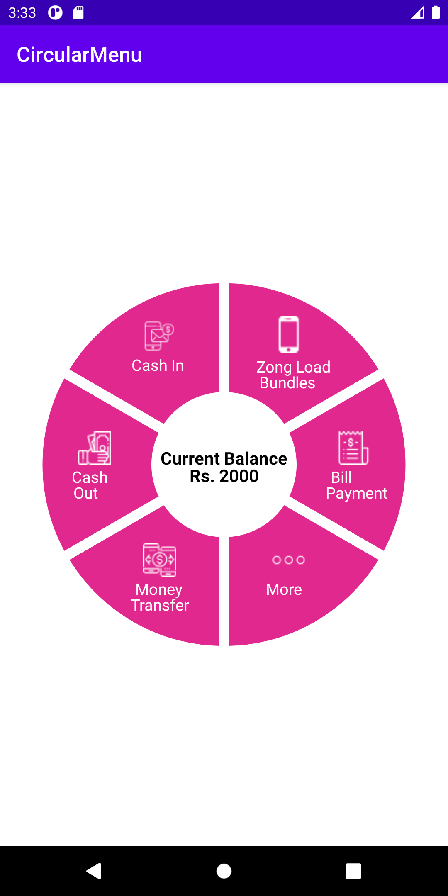
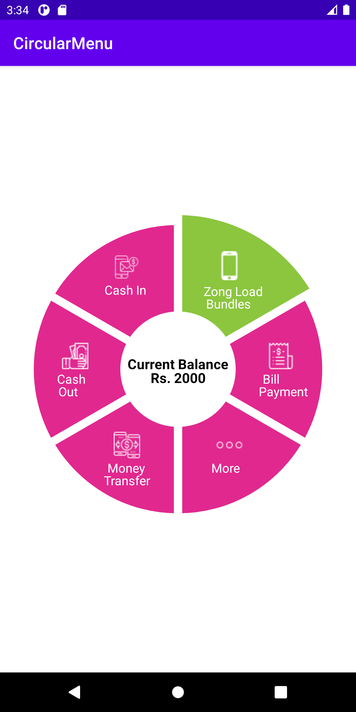
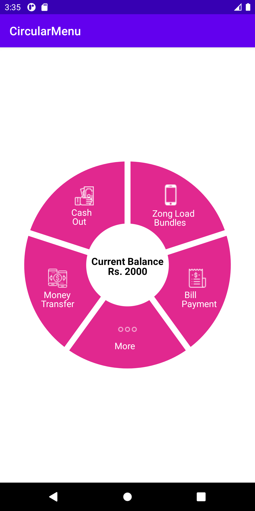
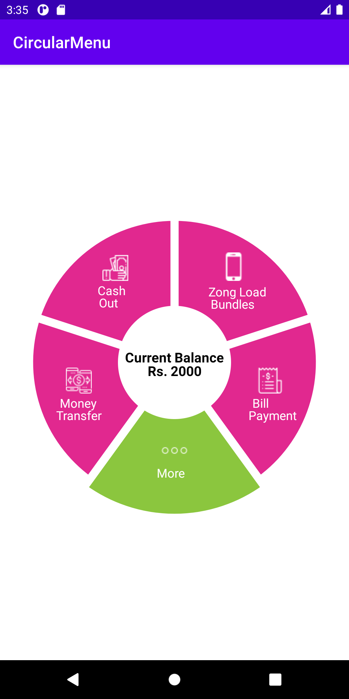
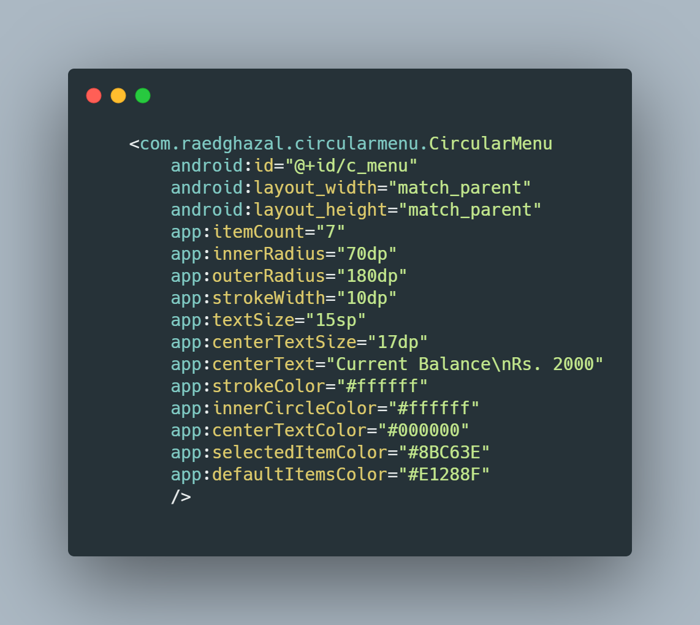
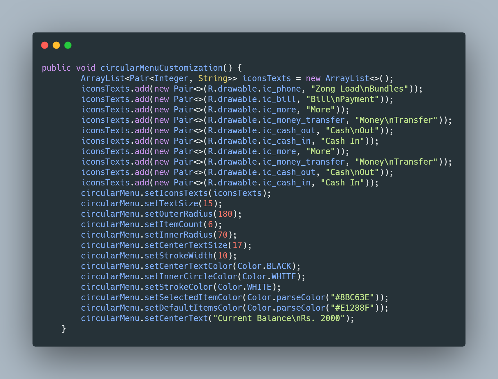

# CircularMenu
A circular menu custom view in android studio - java, fully customizable in both xml and java file

 
 

***properties :  
  itemCount,  
  innerRadius,  
  outerRadius,  
  strokeWidth,  
  textSize,  
  centerTextSize,  
  centerText,  
  strokeColor,  
  innerCircleColor,  
  centerTextColor,  
  selectedItemColor,  
  defaultItemsColor***
  
  xml example : 
  
  
  
  java example :
  
  
  
  **Note** adding texts and icons should be handled in java file.
